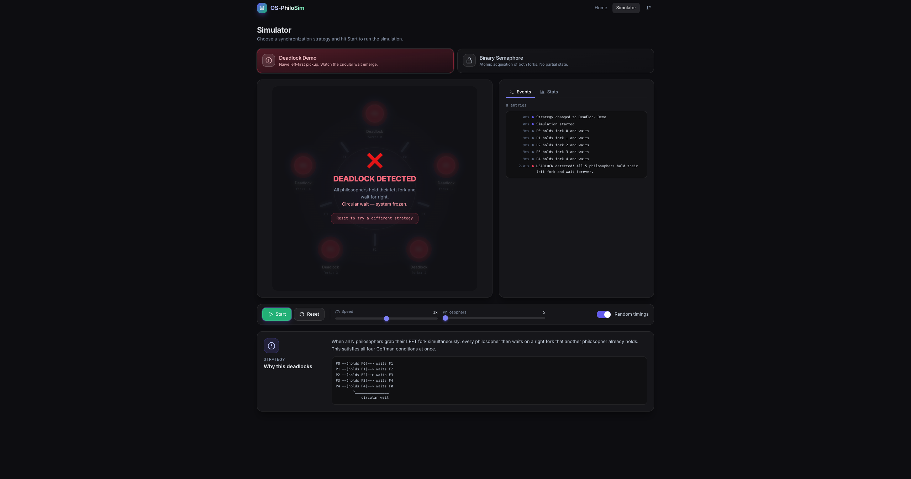
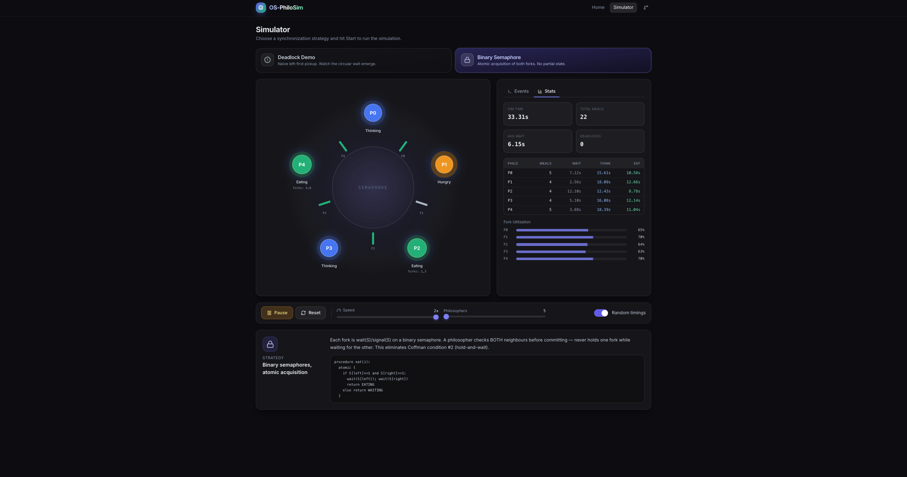

# OS-PhiloSim

> Interactive Operating System Synchronization Laboratory — a live, in-browser visualization of the **Dining Philosophers Problem** with four pluggable concurrency strategies.

OS-PhiloSim is a university Operating Systems project that lets you *watch* deadlock, starvation, and synchronization happen in real time. It implements an FSM-driven simulation engine, several classical synchronization strategies, and a polished React/Tailwind dashboard with charts, event logs, and an "inside the OS" inspector.

---

## Features

- **Live circular-table visualization** — animated SVG philosophers and forks with state-driven colors, glow effects, and Framer Motion transitions.
- **Four synchronization strategies** you can switch on the fly:
  - *Deadlock Demo* — naive left-first acquisition; guaranteed deadlock.
  - *Binary Semaphore* — atomic dual-fork acquisition; deadlock-free.
  - *Central Waiter* — N-1 active diners cap; deadlock & starvation safe.
  - *Resource Ordering* — Dijkstra's hierarchy; breaks circular wait.
- **Deadlock detector** — automatically flags when all philosophers are stuck holding one fork.
- **Statistics panel** — meals per philosopher, total wait/eat/think times, fork utilization, deadlock count, simulation time.
- **Internal OS view** — fork semaphore table, PCB-style process table, and run queues for THINKING / HUNGRY / WAITING / EATING.
- **Event log** with timestamped entries, color-coded by event type, exportable to `.txt`.
- **Live analytics** — bar chart (meals), line chart (cumulative wait), doughnut (fork usage), stacked Gantt-style timeline.
- **Full controls** — Start/Pause/Step, speed slider (0.25x–4x), philosopher count slider (5–10), random-timing toggle.
- **Keyboard shortcuts** — `Space` play/pause, `R` reset, `S` step, `1–4` strategy, `+/-` resize, `F` fullscreen.
- **Toast notifications** for deadlocks and strategy changes.
- **Theory page** with collapsible sections covering process synchronization, critical section, semaphores, mutex, deadlock, starvation, Coffman's conditions, prevention vs avoidance, comparison table, and real-world applications.
- **Glassmorphism dark theme** built on Tailwind v3 + custom design tokens; fully responsive.

---

## Tech Stack

- **React 19** with TypeScript (strict, `verbatimModuleSyntax`, no `any`).
- **Vite** for dev/build.
- **Tailwind CSS v3** with custom design tokens for the dark glass theme.
- **Framer Motion** for transitions and physics-based animation.
- **Chart.js + react-chartjs-2** for live analytics.
- **lucide-react** icons.
- **react-router-dom** for routing.

---

## Installation

```bash
git clone <repo-url> os-philosim
cd os-philosim
npm install
npm run dev
```

Open the URL shown in the terminal (typically `http://localhost:5173/`).

### Available scripts

| Command           | Description                              |
| ----------------- | ---------------------------------------- |
| `npm run dev`     | Start the Vite dev server                |
| `npm run build`   | Type-check and build for production      |
| `npm run preview` | Preview the production build locally     |
| `npm run lint`    | Run oxlint                               |

---

## Folder Structure

```
src/
├── App.tsx
├── main.tsx
├── index.css
├── engine/
│   ├── types.ts           # All TS types: Philosopher, Fork, Strategy, ...
│   ├── eventBus.ts        # Pub/sub event bus (ring buffer, cap 500)
│   ├── stats.ts           # SimStats creation & per-tick updates
│   ├── simulation.ts      # The core FSM engine (RAF loop, deadlock detection)
│   └── strategies/
│       ├── deadlock.ts    # Naive left-first
│       ├── semaphore.ts   # Atomic binary semaphore
│       ├── waiter.ts      # Central arbitrator (N-1 cap)
│       ├── ordering.ts    # Resource hierarchy
│       └── index.ts       # Strategy registry
├── hooks/
│   ├── useSimulation.ts       # React wrapper around the engine
│   ├── useKeyboardShortcuts.ts
│   └── useFullscreen.ts
├── lib/
│   └── utils.ts           # cn, formatMs, clamp, state helpers
├── components/
│   ├── ui/                # Button, Card, Slider, Switch, Tabs, Badge, Toast
│   ├── simulator/         # Table, Philosopher, Fork, EventLog, StatsPanel,
│   │                      # InternalOSView, ControlPanel, ModeSelector,
│   │                      # ModeExplainer
│   ├── charts/            # MealsChart, WaitTimeChart, ForkUsageChart,
│   │                      # TimelineChart
│   ├── layout/            # Navbar, HeroSection, ConceptCard
│   └── theory/            # TheorySection, TheoryPanel
└── pages/
    ├── Home.tsx
    ├── Simulator.tsx
    └── Theory.tsx
```

---

## Architecture

The simulation engine (`src/engine/simulation.ts`) is a deterministic, framework-agnostic class. It exposes `tick(deltaMs)`, `start()`, `pause()`, `step()`, `reset()`, `setSpeed()`, and `setMode()`. The React hook `useSimulation` owns one engine instance in a ref, drives a 100 ms re-render interval, and mirrors the global `eventBus` buffer into local state.

Each strategy implements the small `Strategy` interface (`tryAcquire`, `release`) and is selected at runtime via a registry map. Adding a new strategy is a single-file change.

---
## Screenshots

### Home


### Deadlock Demo


### Binary Semaphore Solution

---

## Future Scope

- Per-philosopher priority levels and an aging policy demo.
- Banker's Algorithm visualizer alongside Dining Philosophers.
- WebWorker engine to keep the main thread free at very high speeds.
- Save/load runs as `.json` for assignment submissions.
- Multiplayer mode where students each control one philosopher.
- Producer/Consumer and Readers/Writers companion modules.

---

## Author

Built as a university Operating Systems course project. PRs welcome.
